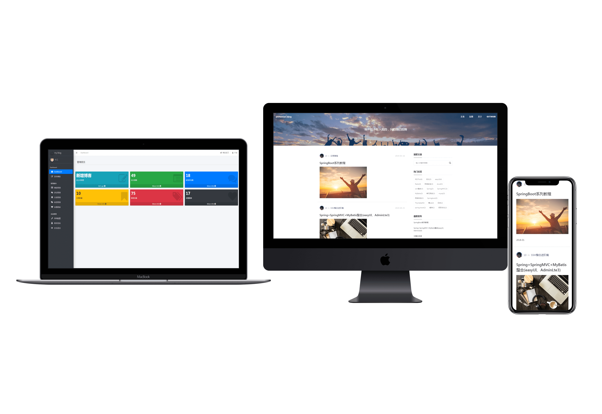

# My Blog
<<<<<<< HEAD



**坚持不易，各位朋友如果觉得项目还不错的话可以给项目一个 star 吧，也是对我一直更新代码的一种鼓励啦，谢谢各位的支持。**


- **你可以拿它作为博客模板，因为 My Blog 界面十分美观简洁，满足私人博客的一切要求；**
- **你也可以把它作为 SpringBoot 技术栈的学习项目，My Blog也足够符合要求，且代码和功能完备；**
- **内置三套博客主题模板，主题风格各有千秋，满足大家的选择空间，后续会继续增加，以供大家打造自己的博客；**
- **技术栈新颖且知识点丰富，学习后可以提升大家对于知识的理解和掌握，对于提升你的市场竞争力有一定的帮助。**


## 注意事项

- **数据库文件目录为```static-files/my_blog_db.sql```；**
- **部署后你可以根据自己需求修改版权文案、logo 图片、备案记录等网站基础信息；**


演示站点：http://swordman.top

## 效果预览

### 后台管理页面

- 登录页

	

- 后台首页

	

- 文章管理

	

- 文章编辑

	

- 评论管理

	

- 系统配置

	

### 博客展示页面

开发时，在项目中**内置了三套博客主题模板，主题风格各有千秋**，效果如下：

#### 模板一

- 首页

	

- 文章浏览

	

- 友情链接

	

#### 模板二

- 首页

	

- 文章浏览

	

- 友情链接

	

#### 模板三

- 首页

  

- 文章浏览

  

- 友情链接

  
  

personal-blog

坚持不易，各位朋友如果觉得项目还不错的话可以给项目一个 star 吧，也是对我一直更新代码的一种鼓励啦，谢谢各位的支持。
数据库文件目录为static-files/my_blog_db.sql；
部署后你可以根据自己需求修改版权文案、logo 图片、备案记录等网站基础信息；
My Blog 还有一些不完善的地方，鄙人才疏学浅，望见谅；
有任何问题都可以反馈给我，我会尽量完善该项目。
>>>>>>> origin/master
